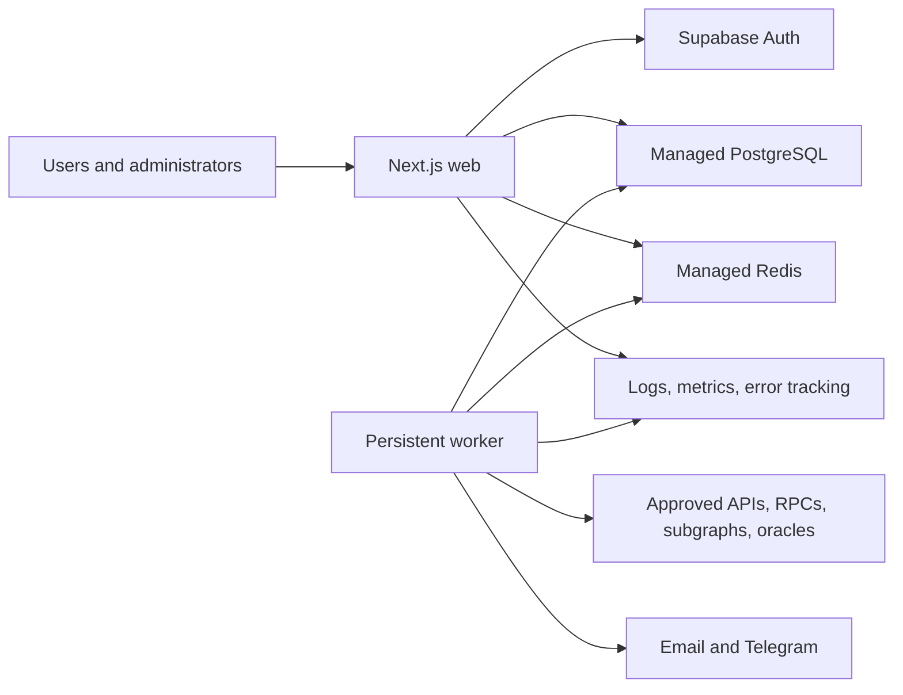

# RWA Yield Router Architecture

Status: target architecture for the first complete production release. REQUIREMENTS.md is normative; material deviations require a decision record.

## 1. Goals and invariants

1. Every material fact and derived result is traceable to sources, timestamps, confidence, status, and a calculation or methodology version.
2. Yield, risk, comparison text, and allocation are deterministic and independently testable.
3. Provider failures create explicit stale, partial, or unavailable states, never invented values or false zeroes.
4. Wallet functionality is read-only; no signing, approvals, transaction construction, execution, custody, or key material exists.
5. Admin publication, methodology changes, jobs, alerts, and releases leave durable audit evidence.

## 2. Technology decisions

| Concern            | Decision                                                                                                |
| ------------------ | ------------------------------------------------------------------------------------------------------- |
| Repository/runtime | pnpm workspaces, Turborepo, strict TypeScript, pinned active-LTS Node.js                                |
| Web                | Next.js App Router, Tailwind CSS, accessible headless UI primitives                                     |
| Storage            | PostgreSQL, Drizzle ORM, checked SQL migrations                                                         |
| Auth               | Supabase Auth behind a local adapter; domain roles stored locally                                       |
| Worker             | Persistent Node.js TypeScript service                                                                   |
| Queue/cache        | Managed Redis with BullMQ                                                                               |
| Contracts          | Zod at boundaries; OpenAPI generated from shared schemas                                                |
| Financial math     | PostgreSQL NUMERIC plus a pinned arbitrary-precision decimal library                                    |
| On-chain reads     | viem public clients only                                                                                |
| Notifications      | Email adapter with console development transport; Telegram Bot API adapter disabled without credentials |
| Observability      | Structured redacted logs, correlation IDs, OpenTelemetry-compatible metrics, error-tracking adapter     |
| Testing            | Vitest, isolated PostgreSQL/Redis integration tests, Playwright, accessibility scans                    |

Dependency versions, chart library, and the HiGHS Node/WASM binding are pinned only after current maintenance, licence, and security review. The optimizer uses a solver-neutral interface; if no safe maintained HiGHS binding exists, use an audited deterministic bounded-simplex adapter, not an abandoned dependency.

## 3. Repository boundaries

    apps/web               Next.js pages, public API, accounts, server-authorized admin
    apps/worker            ingestion, rollups, risk, alerts, reports, scheduled jobs
    packages/config        validated server/client environment
    packages/database      schema, migrations, repositories, test utilities
    packages/domain        canonical enums, units, Zod schemas, invariants
    packages/data-adapters provider ports, normalization, provenance, fallback
    packages/yield-engine  decimal yield, fees, costs
    packages/risk-engine   factors, composites, confidence, penalties
    packages/routing-engine deterministic optimizer and infeasibility analysis
    packages/notifications email, Telegram, in-app adapters
    packages/observability logging, metrics, tracing, redaction
    packages/ui            accessible components and financial formatters
    scripts                import, verification, maintenance
    tests                  fixtures, integration, E2E, smoke

Domain and engine packages do not import React, Next.js, BullMQ, provider SDKs, or database clients. Applications compose ports and adapters. Business calculations never live in components, handlers, jobs, or database triggers.

## 4. Runtime topology

Web owns server-rendered pages, versioned public reads, authenticated/account/admin actions, simulations, read-only wallet analysis, and health endpoints. It does not run long ingestion or delivery work.

Worker owns provider ingestion, source selection, typed snapshots, freshness and quality events, historical rollups, risk recalculation, alert evaluation/delivery, and asynchronous reports.

Web and worker deploy independently from one commit. Migrations run as a discrete release job before traffic, never at application startup. Production uses isolated managed PostgreSQL and Redis; staging mirrors topology with separate credentials; local development uses Docker Compose.

## 5. Trust boundaries

| Input                 | Controls                                                                                                                 |
| --------------------- | ------------------------------------------------------------------------------------------------------------------------ |
| Browser/API           | Zod validation, bounded filters, CSRF/origin controls where relevant, server authorization, rate limits, output encoding |
| Auth callback         | Provider verification, state/nonce, secure cookie exchange, local role lookup                                            |
| Queue payload         | Allowlisted job registry, versioned schema, producer identity, size limit, idempotency                                   |
| Provider response/URL | Host and protocol policy, private-IP and redirect checks, timeout, response-size/content-type limit, schema validation   |
| Admin form/import     | Role check, validation, review/publish workflow, audit log, source validation, formula-safe CSV                          |
| Webhook               | Signature, timestamp, replay protection before business parsing                                                          |

Public identifiers never confer access. Logs and errors exclude secrets, tokens, sessions, unnecessary personal data, and unsafe raw provider payloads.

## 6. Data architecture

### 6.1 Catalog

products model underlying instruments; product_routes model holding/deployment paths; yield_sources model economic income; return exposure is separate. assets/stablecoins, chains/contracts, issuers/protocols, and custodians/administrators/auditors/oracles are independent so multi-chain deployment and concentration are represented correctly.

Eligibility, redemption, transfer, custody, audit, and reserve records are effective-dated and sourced. Eligibility is eligible, ineligible, conditional, or unknown; unknown never defaults to eligible.

### 6.2 Observations and snapshots

source_registry records canonical URL, type, ownership, terms/licence, limits, priority, and status. source_observations is append-only and stores entity, metric, observed/fetched/verified times, confidence, status, raw value when safe, normalized value, unit, adapter version, and provenance hash.

Typed yield, price, NAV, TVL/AUM, liquidity, and utilization snapshots point to selected observations. Competing observations remain. data_quality_events record conflicts, implausible changes, missing/stale transitions, and overrides. adapter_health and job_runs hold operational history.

Daily yield history rollups select the deterministic closing available snapshot for each completed
UTC day. Each rollup retains a foreign key to that immutable yield snapshot (and therefore its
source observation), records its data cutoff and calculation version, excludes the open UTC day,
and accepts only snapshots whose creation and source verification/fetch timestamps do not exceed
the recorded cutoff. Ties prefer lower numeric source priority, later fetch time, then stable
provenance, calculation, source-code, and idempotency keys. The bounded 25,000-bucket job fails
without writes instead of truncating. A database trigger requires every duplicated rollup value to
exactly match the referenced snapshot. The job upserts only when a later admitted source snapshot
changes the selected close. Historical API
points join the rollup or raw fallback snapshot through its exact source observation to the source
registry; every point serializes the source identifier and canonical URL, observation identifier,
observed/fetched/verified timestamps, confidence and status at both observation and snapshot layers,
adapter/source revision, selection and calculation versions, and rollup cutoff when applicable.

An idempotency key over source, external entity, metric, observed time, and source revision prevents duplicate ingestion. A newer adapter version adds a record; it does not rewrite prior evidence.

### 6.3 Analytics and users

apy_components and fee_schedules retain component semantics and effective intervals. Risk factor/composite snapshots retain inputs, evidence, confidence, explanations, and immutable methodology version. Simulation/allocation records retain canonical constraints, data cutoff, candidate/exclusion facts, solver and calculation versions, results, and diagnostics.

Auth subjects map to local users. Preferences, watchlists, saved screener views, comparisons, simulations, and alerts are owner-scoped. Saved comparisons contain two to five ordered route references that were current, active, and published when created or replaced; the references remain as private history if a route later leaves public availability, while the reconstructed public URL resolves against current visibility. Saved views contain only validated canonical filters, sort, and allowlisted column identifiers. Public share URLs are reconstructed from route slugs or filter parameters and never expose private saved-object identifiers. Roles are explicit. admin_audit_logs is append-only with actor, time, target, before/after, reason, source, verification date, and correlation ID.

### 6.4 Storage rules

- UUID public IDs; provider IDs stored separately.
- TIMESTAMPTZ in UTC; IANA timezone only for user display/scheduling.
- NUMERIC for authoritative amounts, rates, ratios, prices, and allocations.
- Explicit unit and currency/asset identifiers.
- JSONB only for bounded raw evidence or versioned calculation input, not relational invariants.
- Foreign keys, checks, uniqueness, explicit delete behavior, archival, and immutable published versions.
- Time/entity indexes for snapshots; representative EXPLAIN ANALYZE before release.

## 7. Ingestion and freshness

Adapters expose supported subsets of discoverProducts, fetchProductMetadata, fetchYield, fetchTVLOrAUM, fetchLiquidity, fetchPrice, fetchNAV, fetchUtilization, fetchHistoricalData, and healthCheck. Results are observation, unavailable, unsupported, rejected, or degraded discriminated unions. Adapters never write presentation snapshots directly.

Flow:

1. scheduler enqueues a versioned idempotent job under provider limits;
2. worker performs a bounded allowlisted request;
3. response is parsed, normalized, and quality checked;
4. the append-only observation and its corresponding typed snapshot commit atomically;
5. after durable effects commit, the job outcome and adapter-health record commit together;
6. a transactional outbox triggers rollups, risk, cache invalidation, and alerts.

Selection rejects invalid/future/semantically incompatible data, then ranks official precedence, metric fitness, freshness, confidence, and source health. Material conflicts create quality events. The selected snapshot records policy version and candidate IDs. Fallback retains its real confidence and never converts absence to zero.

Jobs have stable idempotency keys, locks, timeouts, bounded attempts, exponential backoff with jitter, circuit breakers, per-provider rate/concurrency limits, dead letters, and correlation IDs. Schedules in REQUIREMENTS.md are configuration. A provider outage preserves the last valid observation until its status becomes stale or unavailable.

The Redis client command timeout remains bounded but exceeds BullMQ's intentional blocking waits,
including the configured idle-worker drain delay. Readiness wraps its Redis probe in a separate,
short deadline so a queue outage still fails closed without interrupting healthy long polling.

Every completed ingestion attempt transactionally finalizes its job run and appends adapter health.
Final failures also append a redacted durable dead-letter record; Redis dead-letter payloads are not
the authoritative operational history. A duplicate observation still reconciles its typed snapshot,
so a partial write left by an older interrupted release cannot become a permanently orphaned metric.
Alert-event creation, delivery-outbox reconciliation, and the rule transition share one transaction;
a retry loads the existing deduplicated event and repairs any missing delivery rows.

## 8. Analytics

### 8.1 Yield

The pure yield engine accepts decimals, units, source references, confidence, and as-of times. It combines only compatible rates and keeps base, borrower, Treasury, strategy, and incentive components visible.

For capital C, one-time entry/exit/gas/slippage costs T, and horizon H in years:

    annualizedTransactionCostRate = (T / C) / H
    netAPY = grossAPY
             - annualizedManagementAndProtocolFees
             - annualizedExpectedPerformanceFee
             - annualizedTransactionCostRate

Day-count, fee, compounding, incentive-expiry, and rounding conventions are versioned. Unknown material fees produce a qualified/incomplete result, not assumed zero. Negative yield is valid. Each result stores inputs, observation IDs, warnings, calculation version, and timestamp.

### 8.2 Risk

A published methodology version contains all six category weight sets, transforms, thresholds, confidence rules, penalty curves, and effective time. Published versions are immutable.

Each applicable factor retains its score or unavailable state, evidence, source, confidence, and explanation. Missing evidence cannot improve risk: policy applies a transparent uncertainty/data-quality penalty or makes the composite unavailable below minimum coverage.

Comparative risk-adjusted APY subtracts inspectable liquidity, redemption, issuer, custody, smart-contract, concentration, instability, incentive, market/depeg, and data-quality penalties from net APY. It is a comparative ranking metric, not expected loss.

### 8.3 Routing

The engine freezes a data cutoff and builds candidates from published routes satisfying lifecycle, freshness, confidence, scale, liquidity, eligibility, KYC, incentive, and exclusion rules. Every exclusion has stable reason codes. Route-specific costs are recalculated for capital, origin asset/chain, and horizon.

For allocation xi:

    maximize sum(xi * comparativeRiskAdjustedAPYi)
    subject to sum(xi) = 1

Grouped bounds cover product, issuer, protocol, chain, category, stablecoin, DeFi, RWA, and gold; liquidity minima cover immediate, 24-hour, and seven-day exit. Profiles expand into visible constraints.

Candidates and constraints have stable ordering; solver version, tolerances, and seed are fixed. Results are quantized and revalidated with decimal arithmetic. Any violation returns no allocation. Transaction-cost models carry an explicit availability status. Standard mode excludes candidates with unknown user-specific entry, exit, gas, or slippage costs. Explicit advanced research may rank a before-cost scenario, but numeric zero is only an internal neutral solver boundary: the public and persisted after-cost net metrics remain null, before-cost metrics are named as such, and the missing quote evidence is disclosed.

Infeasibility analysis combines direct exclusion causes, solver conflict/IIS support, and bounded slack minimization. It reports binding constraints and smallest feasible changes but never applies them without a new user-confirmed run. Narratives use deterministic templates whose sentences reference displayed facts.

## 9. Web, API, auth, wallet, and alerts

Public browse uses Server Components and cached read models. Interactive filters, charts, and simulator controls use small client islands. Every value returns status, economic timestamp, confidence, and coverage. UI states are discriminated; formatters cannot turn null into zero. Charts include accessible summaries/tables.

Public /api/v1 endpoints use generated OpenAPI, allowlisted serializers, bounded cursor pagination, stable errors/correlation IDs, rate limits, cache-control, and ETags keyed by representation, snapshot generation, and methodology. Internal admin/job routes are separate and more strongly authorized.

Supabase proves identity; local server policy proves role, action, and object ownership for every query/mutation. Admin publication is transactional and audited. Protected/private pages are no-store and excluded from indexing.

The administration page contains no bundled catalog or operational facts. After the server-rendered authorization gate, its client island requests a bounded, no-store database snapshot through a same-origin, CSRF-protected administrator endpoint. Catalog, source, entity, eligibility, redemption, observation-quality, and methodology changes use strict discriminated request schemas and transactional writes. Catalog edits create superseding drafts; source edits create a draft version while the prior published version remains active, then supersede it transactionally on replacement publication; eligibility and redemption edits append effective versions backed by a source observation; organization metadata retains monotonic before/after revisions in `admin_audit_logs`; and observation overrides append `data_quality_events` without mutating the original observation. Security-audit reads use the separate `SECURITY_ADMIN` capability and omit subject and network hashes from the console response.

Wallet analysis accepts public addresses and configured chains through viem public clients. Signing clients and transaction builders are excluded. Unknown holdings and coverage gaps remain visible; absent RPC support disables the feature truthfully.

Alert evaluation creates a deterministic deduplicated event, applies cooldown/timezone rules, then fans out independent in-app, email, and Telegram deliveries. Delivery states are queued, attempting, delivered, retryable failure, permanent failure, suppressed, or cancelled.

Alert rules retain a bounded lookback and the latest explicit evaluation state. Numeric conditions read current and, where required, point-in-time baseline snapshots; event conditions read versioned terms, quality events, sourced allocation observations, or catalog lifecycle state. If the required evidence is absent, non-current, semantically incompatible, or lacks a baseline, evaluation records `UNAVAILABLE` with a machine-readable reason and creates no delivery. External destinations use a versioned AES-256-GCM envelope and keyed hash under `DATA_ENCRYPTION_KEY`; queue jobs carry only a delivery UUID. The worker resolves and decrypts the owner-scoped destination immediately before dispatch, hashes provider message identifiers, and never writes plaintext destinations to queues or delivery logs.

CSV export allowlists fields, bounds rows, streams output, and neutralizes formulas. Print/PDF reports render from an immutable saved simulation; conversion is sandboxed with no arbitrary URL access.

## 10. Operations, performance, and failure

/health/live checks process life only. /health/ready performs bounded database and critical Redis checks; external provider health is separate so one provider cannot make history unreadable.

Metrics cover web/API/database latency, web vitals, cache hit rate, queue depth/age, failures/dead letters, provider health, observation freshness, stale records, risk lag, and notification outcomes. All requests/jobs use correlation IDs.

Use cached/materialized aggregates, cursor pagination, virtualized tables, chart rollups, batched queries, bounded filters/exports/simulations, dynamic chart/wallet loading, and cancellation/timeouts. TEST_PLAN.md owns numeric budgets.

Failure behavior:

| Failure      | Safe result                                                |
| ------------ | ---------------------------------------------------------- |
| Provider     | Circuit/fallback; last valid data ages visibly             |
| Worker       | Browsing continues; queue-age alert; no false success      |
| Notification | In-app event remains; external attempt retries/logs        |
| Risk/solver  | Prior score becomes stale or no allocation is returned     |
| Auth         | Public browsing works; protected actions fail closed       |
| Database     | Readiness fails; controlled error; no partial mutation     |
| Migration    | Release stops before traffic; rollback/forward-fix runbook |

## 11. Delivery and decisions

Implement foundation, domain/data, analytics, application, verified production data, quality, then production deployment. Only the complete release becomes public. Web/worker/schema compatibility, secure admin bootstrap, ingestion, monitoring, and production smoke tests are release gates.

Create a decision record before changing the custody/execution boundary, taxonomy, database/ORM, auth/session model, source precedence, financial convention, risk missing-data treatment, solver formulation, public API compatibility, retention, or trust/deployment boundary.
